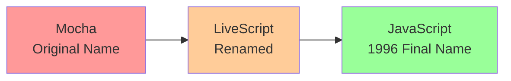

# Introduction to JavaScript

## 💡 What is JavaScript?

JavaScript, often abbreviated as **JS**, is a programming language that is one of the core technologies of the World Wide Web, alongside HTML and CSS. JavaScript allows us to add interactivity to web pages - you might have seen sliders, alerts, click interactions, popups, and more on different websites. All of that is built using JavaScript!

> [!NOTE] > **Beyond the Browser**
> JavaScript isn't limited to web browsers. It's also used in various non-browser environments.

### JavaScript Environments

| Environment         | Purpose                     | Examples                       |
| ------------------- | --------------------------- | ------------------------------ |
| 🌐 **Browser**      | Client-side web development | Interactive websites, web apps |
| 🖥️ **Node.js**      | Server-side JavaScript      | REST APIs, backend services    |
| 💻 **Electron**     | Desktop applications        | VS Code, Slack, Discord        |
| 📱 **React Native** | Mobile applications         | iOS and Android apps           |

---

## 📜 History of JavaScript

JavaScript was initially created by **Brendan Eich** at Netscape and was first announced in a press release in **1995**. It has a rather unusual naming history!

### The Naming Journey



> [!TIP] > **Fun Fact**: Despite the name, JavaScript has **no relationship with Java**! The name was chosen to capitalize on Java's popularity at the time.

**Timeline:**

1. **Mocha** - The original name by creator Brendan Eich
2. **LiveScript** - First renamed version
3. **JavaScript** (1996) - About a year after release, Netscape renamed it to JavaScript, hoping to capitalize on the Java community's popularity

Netscape 2.0 was released with official JavaScript support.

---

## 🔢 JavaScript Versions

JavaScript, invented by Brendan Eich, achieved the status of an **ECMA standard** in 1997 and adopted the official name **ECMAScript**.

### Version History

| Version          | Year         | Key Features                                           | Impact                  |
| ---------------- | ------------ | ------------------------------------------------------ | ----------------------- |
| **ES1**          | 1997         | First edition                                          | 🟢 Foundation           |
| **ES2**          | 1998         | Minor improvements                                     | 🟢 Refinement           |
| **ES3**          | 1999         | Regular expressions, try/catch                         | 🟡 Enhanced             |
| **ES5**          | 2009         | Strict mode, JSON support, Array methods               | 🟡 Modernized           |
| **ES6 (ES2015)** | 2015         | Arrow functions, classes, modules, promises, let/const | 🔴 **Transformative!**  |
| **ES2016+**      | 2016-present | Yearly updates with new features                       | 🟢 Continuous evolution |

> [!IMPORTANT] > **ES6: The Game Changer**
> ES6 (also known as ES2015) is considered the most significant update in JavaScript's history. It brought massive improvements that made JavaScript a modern, powerful language suitable for large-scale applications.

### ES6 Highlights

```js
// Before ES6
var greeting = function (name) {
	return "Hello, " + name;
};

// After ES6
const greeting = (name) => `Hello, ${name}`;
```

---

## 🎯 Why Learn JavaScript?

### Top Reasons

| Reason                    | Description                                                                        |
| ------------------------- | ---------------------------------------------------------------------------------- |
| 🌍 **Universal Language** | Runs on browsers, servers (Node.js), mobile (React Native), and desktop (Electron) |
| 📦 **Huge Ecosystem**     | npm has millions of packages, countless frameworks and libraries                   |
| 💼 **High Demand**        | Most sought-after skill in the IT industry                                         |
| 🎓 **Beginner Friendly**  | Easy syntax to learn, immediate feedback in the browser                            |

> [!TIP] > **Career Opportunity**
> JavaScript developers are among the most in-demand professionals in tech. Learning JavaScript opens doors to frontend, backend, mobile, and full-stack development roles.

---

## 📋 Prerequisites

Before diving into JavaScript, you should have:

-   ✅ Basic understanding of HTML/CSS
-   ✅ Basic logical thinking skills
-   ✅ No prior programming experience required!

> [!NOTE] > **Complete Beginners Welcome**
> JavaScript is beginner-friendly and often recommended as a first programming language. You can start learning even without any coding background!

---

## 🚀 Next Steps

Ready to begin your JavaScript journey?

👉 **Continue to:** [Variables](/en/languages/javascript/2-variables/)

Learn about declaring variables using `var`, `let`, and `const`.
