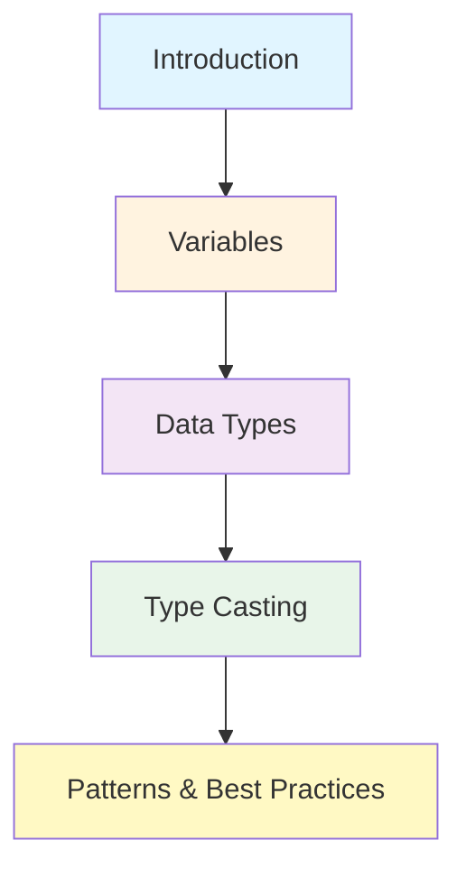

# JavaScript

JavaScript is the world's most popular programming language, used to create interactive websites and web applications.

---

## 📚 Learning Path

Explore JavaScript from fundamentals to advanced concepts:

### 🌟 Core Topics

#### 📖 [Introduction to JavaScript](/en/languages/javascript/1-introduction/)

What is JavaScript, its history, and version evolution

---

#### 🔤 [Variables](/en/languages/javascript/2-variables/)

Variable declarations: `var`, `let`, `const`, hoisting, naming rules, scopes

---

#### 🎨 [Data Types](/en/languages/javascript/3-data-types/)

Primitive types, Objects, Prototypes, Built-in Objects

---

#### 🔄 [Type Casting](/en/languages/javascript/4-type-casting/)

Implicit and Explicit Type Conversion, best practices

---

#### 🎯 [JavaScript Patterns](/en/languages/javascript/patterns/)

Design patterns and best practices for clean code

---

## 💡 Why Learn JavaScript?

| Benefit                   | Description                                                                        |
| ------------------------- | ---------------------------------------------------------------------------------- |
| 🌍 **Universal Language** | Runs on browsers, servers (Node.js), mobile (React Native), and desktop (Electron) |
| 📦 **Huge Ecosystem**     | Millions of npm packages, countless frameworks and libraries                       |
| 💼 **High Demand**        | Most sought-after skill in the IT industry                                         |
| 🎓 **Beginner Friendly**  | Easy-to-learn syntax, immediate feedback in the browser                            |

> [!TIP] > **Career Opportunities**
> JavaScript developers are in high demand across all tech sectors - from startups to Fortune 500 companies!

---

## 📋 Prerequisites

Before starting, you should have:

-   ✅ Basic understanding of HTML/CSS
-   ✅ Basic logical thinking skills
-   ✅ No prior programming experience required!

> [!NOTE] > **Complete Beginners Welcome**
> JavaScript is an excellent first programming language. You can start learning even without any coding background!

---

## 🎯 Recommended Learning Path

| Level            | Topics                                | Goal                                |
| ---------------- | ------------------------------------- | ----------------------------------- |
| **Beginner**     | Introduction, Variables, Data Types   | Understand JavaScript fundamentals  |
| **Intermediate** | Type Casting, Control Flow, Functions | Write functional JavaScript code    |
| **Advanced**     | Patterns, Async/Await, Modules        | Build production-ready applications |

---

## 🚀 Get Started Now!

Begin your JavaScript journey with the fundamentals:

👉 **Start Here:** [Introduction to JavaScript](/en/languages/javascript/1-introduction/)

Learn what JavaScript is, explore its history, and understand its evolution.

---

## 📖 Additional Resources

> [!TIP] > **Learning Tips**
>
> -   Practice coding daily, even if just for 15 minutes
> -   Build small projects to apply what you learn
> -   Join developer communities for support
> -   Don't just read - write code!

### What's Next After Basics?

Once you're comfortable with JavaScript fundamentals:

1. **Learn the DOM** - Manipulate web pages with JavaScript
2. **Async JavaScript** - Promises, async/await, fetch API
3. **ES6+ Features** - Modern JavaScript syntax and features
4. **Frameworks** - React, Vue, or Angular
5. **Node.js** - Server-side JavaScript development

---

> [!IMPORTANT] > **Practice is Key**
> The best way to learn JavaScript is by writing code. Start with small exercises and gradually build more complex applications.
